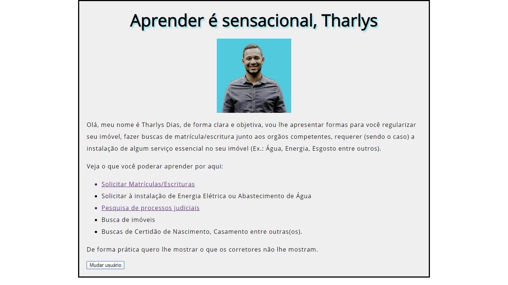

# tharlysdias.github.io
Website criado a partir de conhecimentos fornecidos pelo MDN da série Começando na Web, com conceitos e aspectos práticos do desenvolvimento web. Além de apresentação das ferramentas necessárias para construir um página.

<strong> PÁGINA WEB </strong>

<h1 align="center"> DARK MODE </h1>

Começando na Web, introduzindo aspectos práticos do desenvolvimento web. Conhecimentos da comunidade <strong>MDN</strong> ferramentas para construir uma página simples.

---
Feito com ♥ by Tharlys Dias
